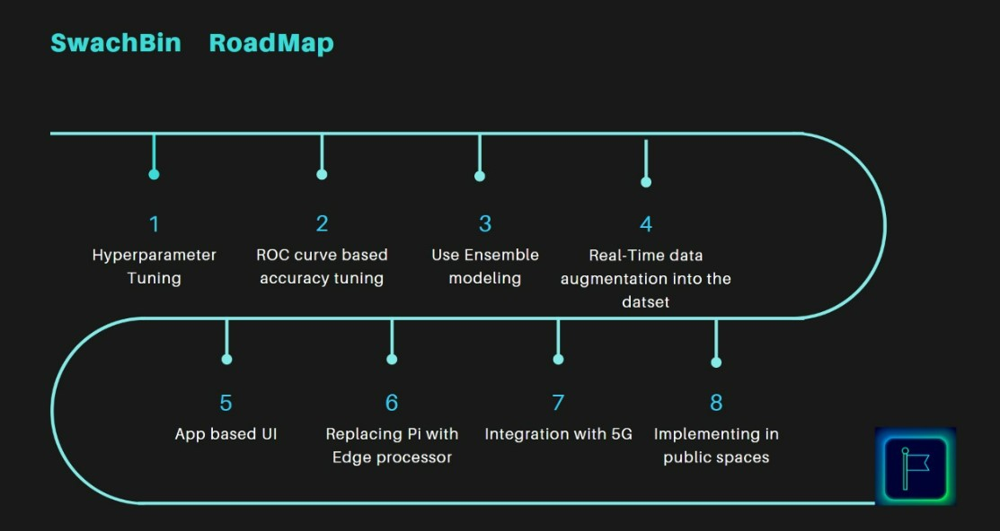
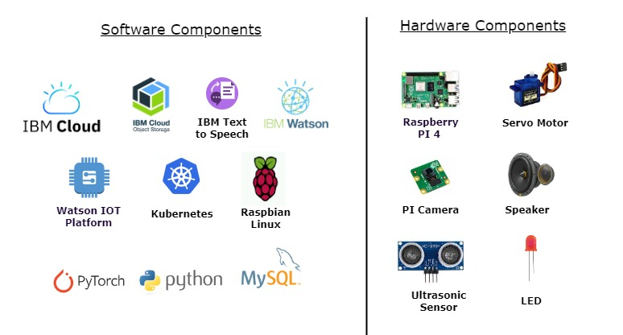

# SWACHBIN 

A smart AI powered trash bin which identifies and detects the trash and performs classification at source enabling sustainability.

  ## Contents

1. [Short Description](#short-description)
1. [Demo Video](#demo-video)
1. [The Architecture](#architecture-overview)
1. [Long Description](#long-description)
1. [Project Roadmap](#project-roadmap)
1. [Live Demo](#live-demo)
1. [Built With](#built-with)
1. [The Team](#team)
1. [License](#license)

## Short description 

### What's the problem?

### How can technology help?

### The idea

## Demo video

## Architecture Overview

    1. The waste material / trash is presented in front of the camera that is connected to the SwachBin (powered by Raspberry Pi.)
    2. The captured image of the waste is sent to the Raspberry Pi.
    3. AI Engine at the processes the image and identifies the class of the trash and the category it belongs to. We used Resnet algorithm, winner of multiple algorithm related comepetitions, can have a very deep network of up to 152 layers by learning the residual representation functions instead of learning the signal representation directly.
    4. Depending on the classification, the AI engine sends the corresponding signal to the servo motor, to open the respective lid of the bin.
    5. Classification details are further stored in the SQL database. 
    6. Activity details gets updated in the Docker container.
    7. Depending on the class type of the trash, the LED indicator is turned ON and the speaker conveys the same information as a voice message to the user.
    8. The ultrasonic sensor senses the trash level and sends the information to the flask app to be displayed in the dashboard.
    9. All the information gets displayed in the IoT dashboard.
## Long description
**Key Modules of swachBin:**
1. Hardware based front end
2. AI driven middle ware
3. IoT and SQL infused backend

## Features

## Project roadmap

## Built with

## Getting started

## Installation

## Live demo 

## Team
- [Bharathi Athinarayanan](https://github.com/rathisoft) - _Product owner & AI / ML architect_ 
- [Suneetha Jonnadula](https://github.com/Sunivihaan) - _Lead Full stack developer_
- [Prashanth P](https://github.com/Prashanthp) - _Principal Application developer_
- [Mohamed Fazil](https://github.com) - _AI / ML Development Engineer_

## License
This project is licensed under the Apache 2 License - see the [LICENSE](LICENSE) file for details.

